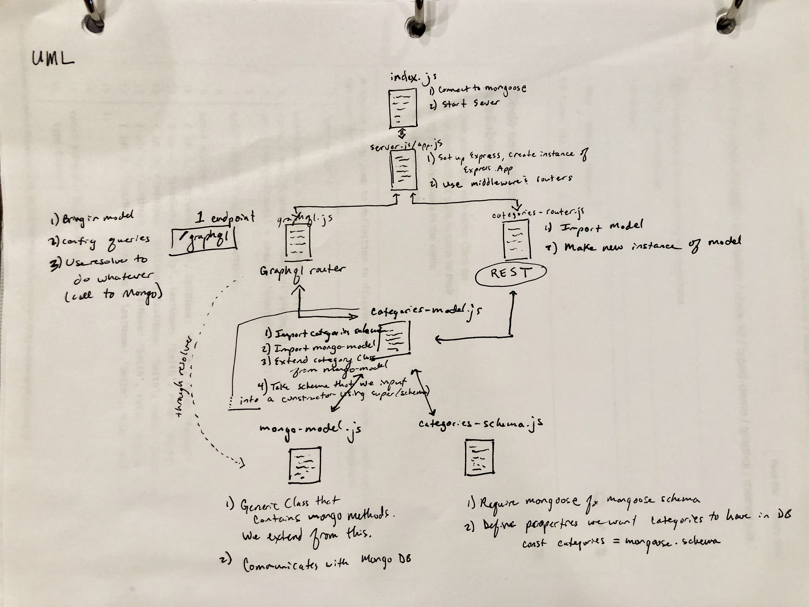

# LAB - 10
​
## GRAPHQL
- Add GraphQL Support to a functioning REST API
​
### Author: Julie Erlemeier
​
### Links and Resources
* [submission PR](http://xyz.com)
* [travis](http://xyz.com)
* [back-end](http://xyz.com) (when applicable)
* [front-end](http://xyz.com) (when applicable)
​
#### Documentation
* [api docs](http://xyz.com) (API servers)
* [jsdoc](http://xyz.com) (Server assignments)
* [styleguide](http://xyz.com) (React assignments)
​
### Modules
#### `modulename.js`
##### Exported Values and Methods
​
###### `foo(thing) -> string`
Usage Notes or examples
​
###### `bar(array) -> array`
Usage Notes or examples
​
### Setup
#### `.env` requirements
* `PORT` - Port Number
* `MONGODB_URI` - URL to the running mongo instance/db
#### dependecies
```
 "dependencies": {
    "apollo": "^2.15.0",
    "apollo-boost": "^0.4.3",
    "apollo-fetch": "^0.7.0",
    "express": "^4.17.1",
    "express-graphql": "^0.8.0",
    "graphql": "^14.4.1",
    "graphql-request": "^1.8.2",
    "graphql-tag": "^2.10.1",
    "graphql-tools": "^4.0.5",
    "jest": "^24.8.0",
    "mongoose": "^5.6.2",
    "node-fetch": "^2.6.0"
  }
```
​
#### Running the app
* `npm start`
* Endpoint: `/foo/bar/`
  * Returns a JSON object with abc in it.
* Endpoint: `/bing/zing/`
  * Returns a JSON object with xyz in it.
  
#### Tests
* No tests were required for this lab.
​
#### UML
